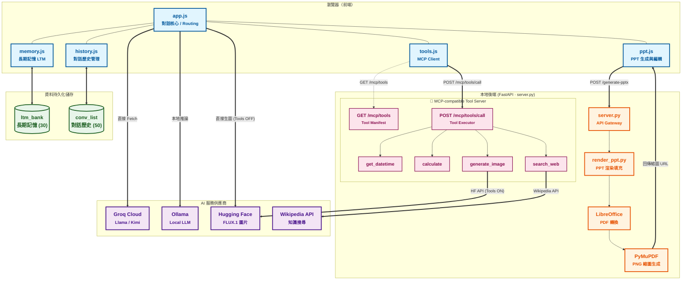

# You-own-ChatGPT 系統架構

## 專案概覽

一個自架的 AI 聊天介面，整合多家 LLM 供應商、自動化 PPT 生成、長期記憶與 MCP-compatible Tool Use。
純靜態前端 + 一支 FastAPI 後端，**AI 對話流量不經過後端**，直接從瀏覽器打雲端 API。
工具執行（Tool Use）則統一透過後端 MCP Tool Server 處理。

---

## 整體架構



---

## 模組說明

### 前端

| 檔案 | 職責 |
|------|------|
| `app.js` | 主控：送訊息、串流渲染（SSE）、Tool Use loop（最多 5 輪）、Auto Routing、Provider 切換、圖片上傳、直接生圖（HF FLUX，Tools OFF） |
| `memory.js` | 長期記憶（LTM）：localStorage `ltm_bank` 讀寫、AI 萃取事實、在 System Prompt 尾端注入記憶條目 |
| `history.js` | 對話歷史：localStorage 儲存（最多 50 份）、monkey-patch `sendMessage` 觸發存檔 + LTM 萃取 + AI 自動命名 |
| `ppt.js` | PPT 流程：讓 AI 生成 slides JSON → POST 後端產生 pptx → 輪播縮圖預覽 → 投影片內聯編輯器 → 下載 |
| `tools.js` | **MCP Client**：定義工具清單傳給 LLM；AI 決定呼叫後，統一透過 `POST /mcp/tools/call` 路由至 MCP server 執行；圖片結果直接渲染 `` |

### 後端

| 檔案 | 職責 |
|------|------|
| `server.py` | FastAPI 後端：PPT 生成、PDF 轉換、縮圖產生、pptx 下載；**MCP-compatible Tool Server**（工具 manifest + 統一執行入口） |
| `render_ppt.py` | 範本佈局偵測（`detect_layouts`）、投影片填入（`render_slide`）、字型與語言套用 |

---

## AI 供應商

| Provider | 使用場景 |
|----------|----------|
| **Groq** | 主要對話（Kimi K2、Llama 70B/8B、Llama 4 Scout） |
| **Ollama** | 本地 LLM，動態讀取 `/api/tags` 取得模型清單 |
| **Hugging Face** | 圖片生成（FLUX.1-schnell）：Tools OFF 時由前端直接呼叫；Tools ON 時由 MCP `generate_image` tool 經 server 呼叫 |
| **Wikipedia** | 知識搜尋，由 MCP `search_web` tool 經 server 代理 |

---

## 核心流程

### 1. 一般對話流

```
使用者輸入
  → Auto Routing 選模型（僅 Groq）
  → 注入 LTM 記憶到 System Prompt 尾端
  → 瀏覽器直接 fetch Groq / Ollama API
  → 串流 SSE 渲染 or 非串流 JSON
  → history.js patch：存檔 + AI 命名 + 觸發 LTM 萃取（背景靜默）
```

### 2. Tool Use / MCP 工具流

```
使用者輸入（Tools 開啟）
  → tools.js 將 TOOL_DEFINITIONS 帶入 API 請求（tool_choice: auto）
  → AI 決定呼叫工具，回傳 finish_reason = "tool_calls"
  → 前端 POST /mcp/tools/call { name, arguments }
      ├── get_datetime  → Python datetime（台北時區）
      ├── calculate     → Python math eval
      ├── search_web    → server 代理 Wikipedia API
      └── generate_image → server 呼叫 HF FLUX.1-schnell → 存 cache/generated/
  → 結果回傳 AI，AI 整合後給出最終回覆
  → generate_image 結果直接渲染  於對話泡泡（不顯示 JSON）
  （以上 loop 最多 5 輪）
```

### 3. PPT 生成流

```
使用者輸入主題（或 /ppt 指令）
  → AI 生成 slides JSON（type: title/bullets/content/quote/closing + theme）
  → POST /generate-pptx-preview
      ├── render_ppt.py 偵測範本 layout → 填入內容
      ├── soffice 轉 PDF
      └── PyMuPDF 產生每頁 PNG 縮圖
  → 前端輪播預覽（點擊投影片可進入編輯器）
  → 編輯後重送 /generate-pptx-preview（整份重建）
  → GET /download/{job_id} 下載 .pptx
```

### 4. 長期記憶流

```
每次對話完成（sendMessage 結束）
  └─ history.js 觸發 extractMemoriesFromHistory()（memory.js）
      ├── 需 >= 2 輪使用者訊息才執行
      ├── 呼叫 LLM 萃取值得記住的事實（maxTokens: 150）
      ├── 過濾近似重複後寫入 localStorage['ltm_bank']（上限 30 條）
      └── 下次對話自動注入 System Prompt 尾端（不主動提及）
```

---

## Auto Routing 規則

> 僅在 **Groq provider** 且使用者開啟 Auto Route 開關時生效。

| 優先順序 | 條件 | 行為 |
|----------|------|------|
| 0 | 含生圖意圖且 Tools OFF（如「生成一張貓圖」） | 直接呼叫 HF，跳過 AI |
| 1 | 有附圖片 | 路由至 `llama-4-scout-17b-16e-instruct`（Vision） |
| 2 | 含程式關鍵字 / 輸入超過 400 字 | 路由至 `llama-3.3-70b-versatile` |
| 3 | 輸入少於 80 字 | 路由至 `llama-3.1-8b-instant` |
| 4 | 其他（兜底） | 路由至 `moonshotai/kimi-k2-instruct` |

---

## 後端 API 端點

### PPT 相關

| 方法 | 路徑 | 說明 |
|------|------|------|
| GET | `/templates` | 列出 `input/` 內所有 .pptx 範本 + 縮圖 URL |
| GET | `/thumbnails/{filename}` | 取得範本首頁縮圖 PNG |
| POST | `/generate-pptx-preview` | AI slides JSON → pptx → PDF → 縮圖，回傳 `job_id` |
| GET | `/job-preview/{job_id}` | 取得該 job 所有縮圖 URL 清單 |
| GET | `/job-slide/{job_id}/{filename}` | 取得單張縮圖 PNG |
| PATCH | `/job/{job_id}/slide/{idx}` | 更新投影片內容 → 整份重建 |
| GET | `/download/{job_id}` | 下載 result.pptx |

### MCP Tool Server

| 方法 | 路徑 | 說明 |
|------|------|------|
| GET | `/mcp/tools` | 回傳工具 manifest（MCP inputSchema 格式） |
| POST | `/mcp/tools/call` | 執行工具，接受 `{ name, arguments }`，回傳 `{ content: [{type, text}] }` |
| GET | `/generated/{filename}` | 取得 `generate_image` 產生的圖片 PNG |

### 搜尋

| 方法 | 路徑 | 說明 |
|------|------|------|
| GET | `/search` | Wikipedia 代理搜尋（MCP `search_web` 內部呼叫） |

---

## 檔案結構

```
HW1---You-own-ChatGPT/
├── index.html              主頁面
├── app.js                  對話核心
├── memory.js               長期記憶模組
├── history.js              對話歷史模組
├── ppt.js                  PPT 生成模組
├── tools.js                MCP Client / Tool Use 模組
├── style.css               UI 樣式
├── server.py               FastAPI 後端 + MCP Tool Server
├── render_ppt.py           簡報渲染邏輯
├── requirements.txt        Python 依賴
│
├── config/
│   ├── api_key.config      GROQ_API_KEY / HF_API_KEY
│   ├── providers.json      供應商 & 模型定義
│   ├── ui.config           語言 / 字型設定
│   └── i18n.json           多語系翻譯字串
│
├── input/                  PPT 範本資料夾（.pptx）
└── cache/
    ├── previews/           範本縮圖快取
    ├── jobs/               每次生成的 pptx + PDF + 縮圖
    ├── generated/          MCP generate_image 產生的圖片
    └── logs/               debug.log
```

---

## PPT 投影片類型

| type | 欄位 | 說明 |
|------|------|------|
| `title` | title, subtitle | 封面，第一張固定 |
| `bullets` | title, bullets[] | 條列要點 |
| `content` | title, body | 段落內文 |
| `quote` | title, quote | 引言，自動加引號 |
| `closing` | title, subtitle | 結語，最後一張固定 |

---

## 資料持久化

| 資料 | 儲存位置 | 上限 |
|------|----------|------|
| 對話歷史 | `localStorage['conv_list']` + `localStorage['conv_{id}']` | 50 份對話 |
| 長期記憶 | `localStorage['ltm_bank']` | 30 條事實 |
| PPT 暫存 | `cache/jobs/{uuid}/` | 無自動清理 |
| 範本快取 | `cache/previews/` | 依 .pptx 修改時間更新 |
| 生成圖片 | `cache/generated/` | 無自動清理 |
