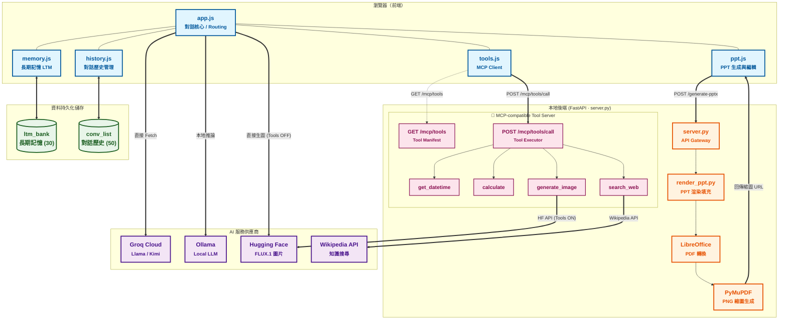

## 整體架構

```mermaid
graph TD
    classDef browser fill:#e1f5fe,stroke:#01579b,stroke-width:3px,color:#01579b,font-size:20px,font-weight:bold;
    classDef backend fill:#fff3e0,stroke:#e65100,stroke-width:3px,color:#e65100,font-size:20px,font-weight:bold;
    classDef mcpNode fill:#fce4ec,stroke:#880e4f,stroke-width:2px,color:#880e4f,font-size:18px,font-weight:bold;
    classDef external fill:#f3e5f5,stroke:#4a148c,stroke-width:3px,color:#4a148c,font-size:20px,font-weight:bold;
    classDef storage fill:#e8f5e9,stroke:#1b5e20,stroke-width:3px,color:#1b5e20,font-size:20px,font-weight:bold;

    subgraph Browser["瀏覽器（前端）"]
        app["<b>app.js</b><br/><small>對話核心 / Routing</small>"]
        memory["<b>memory.js</b><br/><small>長期記憶 LTM</small>"]
        history["<b>history.js</b><br/><small>對話歷史管理</small>"]
        ppt["<b>ppt.js</b><br/><small>PPT 生成與編輯</small>"]
        tools["<b>tools.js</b><br/><small>MCP Client</small>"]
    end

    subgraph Backend["本地後端 (FastAPI · server.py)"]
        server["<b>server.py</b><br/><small>API Gateway</small>"]
        subgraph MCPServer["🔧 MCP-compatible Tool Server"]
            mcp_list["<b>GET /mcp/tools</b><br/><small>Tool Manifest</small>"]
            mcp_call["<b>POST /mcp/tools/call</b><br/><small>Tool Executor</small>"]
            tool_dt["<b>get_datetime</b>"]
            tool_calc["<b>calculate</b>"]
            tool_search["<b>search_web</b>"]
            tool_img["<b>generate_image</b>"]
        end
        render["<b>render_ppt.py</b><br/><small>PPT 渲染填充</small>"]
        soffice["<b>LibreOffice</b><br/><small>PDF 轉換</small>"]
        pymupdf["<b>PyMuPDF</b><br/><small>PNG 縮圖生成</small>"]
    end

    subgraph External["AI 服務供應商"]
        groq["<b>Groq Cloud</b><br/><small>Llama / Kimi</small>"]
        ollama["<b>Ollama</b><br/><small>Local LLM</small>"]
        hf["<b>Hugging Face</b><br/><small>FLUX.1 圖片</small>"]
        wiki["<b>Wikipedia API</b><br/><small>知識搜尋</small>"]
    end

    subgraph Storage["資料持久化儲存"]
        ltm[("<b>ltm_bank</b><br/>長期記憶 (30)")]
        conv[("<b>conv_list</b><br/>對話歷史 (50)")]
    end

    %% 節點分類
    class app,memory,history,ppt,tools browser;
    class server,render,soffice,pymupdf backend;
    class mcp_list,mcp_call,tool_dt,tool_calc,tool_search,tool_img mcpNode;
    class groq,ollama,hf,wiki external;
    class ltm,conv storage;

    %% 前端 → AI（直接 Fetch）
    app ==>|"直接 Fetch"| groq
    app ==>|"本地推論"| ollama
    app ==>|"直接生圖 (Tools OFF)"| hf

    %% 前端模組連線
    app --- memory
    app --- history
    app --- ppt
    app --- tools

    memory <==> ltm
    history <==> conv

    %% MCP Client → MCP Server
    tools ==>|"POST /mcp/tools/call"| mcp_call
    tools -.->|"GET /mcp/tools"| mcp_list

    %% MCP 分派至各工具
    mcp_call --> tool_dt
    mcp_call --> tool_calc
    mcp_call --> tool_search
    mcp_call --> tool_img

    %% MCP 工具 → 外部服務
    tool_search ==>|"Wikipedia API"| wiki
    tool_img ==>|"HF API (Tools ON)"| hf

    %% PPT 生成流程
    ppt ==>|"POST /generate-pptx"| server
    server --> render
    render --> soffice
    soffice --> pymupdf
    pymupdf ==>|"回傳縮圖 URL"| ppt
```
